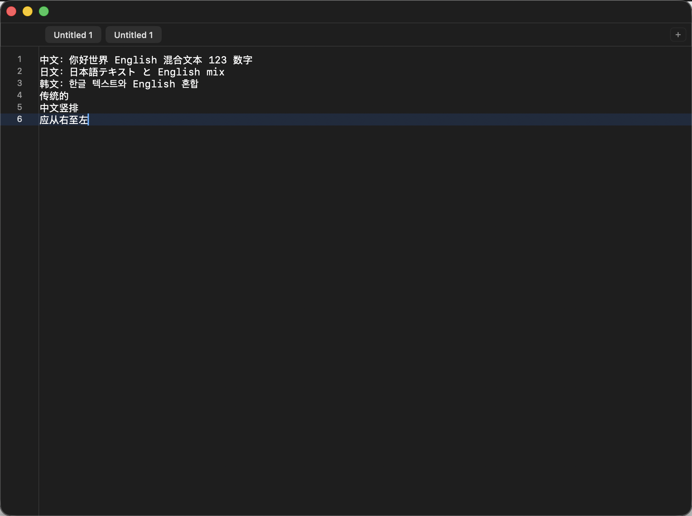

# Seditor (macOS)

原生 `AppKit` 极简文本编辑器，面向个人使用，强调小体积、低资源占用、良好 CJK 输入体验。



## 已实现

- 左侧行号 + 右侧滚动条
- 原生触控板手势滚动
- 自动保存（0.8 秒防抖，写入 `~/Library/Application Support/Seditor/autosave.txt`）
- 打开/保存文件
  - `Cmd+O` 打开
  - `Cmd+S` 保存
  - `Shift+Cmd+S` 另存为
- 多标签
  - `Cmd+T` 新建标签
  - `Cmd+W` 关闭当前标签
  - `Shift+Cmd+]` / `Shift+Cmd+[` 切换标签
  - 顶部右侧 `+` 按钮新建标签
- 仅渲染可视区行号（大文件更省资源）
- 主题切换（System/Light/Dark）
- 字体大小调整（View 菜单）

## 运行

```bash
swift run Seditor
```

## 打包 .app（固定图标）

项目已包含固定图标资源：
- `/Users/x/Documents/Seditor/Assets/AppIcon.icns`

一键打包：

```bash
cd "/Users/x/Documents/Seditor"
./scripts/build_app.sh
```

输出位置：
- `/Users/x/Documents/Seditor/dist/Seditor.app`

## 工具链问题排查

如果你遇到 `Swift` 编译器和 SDK 版本不匹配（`this SDK is not supported by the compiler`），先检查并对齐工具链：

```bash
xcode-select -p
xcodebuild -version
swift --version
sudo xcode-select -s /Applications/Xcode.app/Contents/Developer
```

## 核心文件

- `/Users/x/Documents/Seditor/Package.swift`
- `/Users/x/Documents/Seditor/Assets/AppIcon.icns`
- `/Users/x/Documents/Seditor/scripts/build_app.sh`
- `/Users/x/Documents/Seditor/Sources/Seditor/App/Main.swift`
- `/Users/x/Documents/Seditor/Sources/Seditor/App/AppDelegate.swift`
- `/Users/x/Documents/Seditor/Sources/Seditor/Core/EditorSession.swift`
- `/Users/x/Documents/Seditor/Sources/Seditor/Core/EditorTheme.swift`
- `/Users/x/Documents/Seditor/Sources/Seditor/Views/EditorTextView.swift`
- `/Users/x/Documents/Seditor/Sources/Seditor/Views/GutterView.swift`
